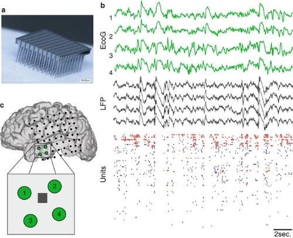

#core/appliedneuroscience

A measure of the **electrical activity in a brain region from the summed electrical activity of many neurons.** Reflects the changes in voltage in a specific region due to the synchronised activity of many neurons. It can be used to study brain function.

## What Generates the Signal

- Field potentials are dominated by **summed [postsynaptic potentials](ipsps_and_epsps.md)** — transmembrane synaptic currents flowing across the aligned dendrites of local populations, especially pyramidal neurons — rather than by action potentials themselves.
- Because pyramidal dendrites are arranged in parallel, synchronised input sums into [dipoles](../06_neuroimaging_in_mental_health/dipoles_in_eeg.md) detectable outside the tissue; this is the population-level readout of the [types of biological electrical activity](types_of_biological_electrical_activity.md).
- The trade-off: individual cells and sub-threshold membrane potentials **cannot** be resolved — those require intracellular access (see [Electrophysiology measurements](electrophysiology_measurements.md)).

## Recording Configurations

The slide shows one signal family across scales (example traces span a 2 s window):

- **ECoG (electrocorticography)** — electrode grids placed on the cortical surface record population oscillations just above the tissue. Used clinically (e.g. epilepsy monitoring) and in brain–computer interfaces.
- **LFP (local field potential)** — microelectrodes or depth probes within the tissue record the low-frequency, synaptically dominated component of local-circuit activity.
- **Units** — the same penetrative electrodes, high-pass filtered, resolve individual action potentials as raster plots at single-cell resolution.

Dense needle grids such as Utah-style microelectrode arrays (panel a, 100 μm scale bar) sit at the LFP–unit end of this hierarchy.

## Trade-offs

- **Invasiveness vs resolution**: moving from ECoG → LFP → units increases both spatial resolution and invasiveness — from macroscopic surface signals down to single neurons.
- **Millisecond temporal resolution** at a **local-circuit** spatial scale — orders of magnitude faster than haemodynamic imaging such as fMRI.
- Recordable both [in vivo and in vitro](in_vivo_vs_in_vitro.md); the full ladder of configurations is compared in [Summary of extracellular recordings](summary_of_extracellular_recordings.md).
