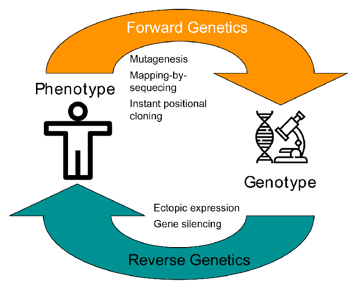

#core/appliedneuroscience

Forward genetics and backward genetics are **two methods used in animal models to study the relationship between genetics and phenotypes.** 

- Forward genetics starts with a phenotype and works towards identifying the genetic variation responsible for it.
- Backward genetics starts with a known genetic variation and determines the resulting phenotype. The main difference between the two is the approach’s starting point and direction.
