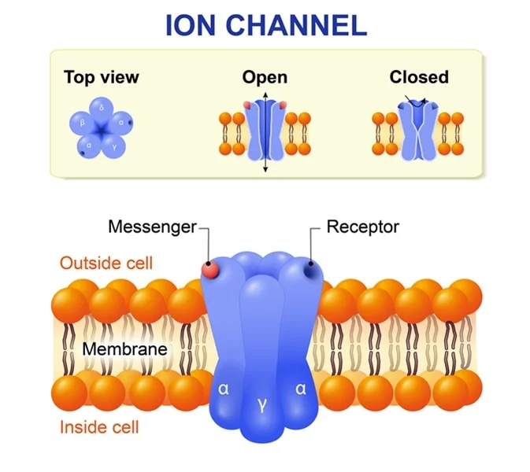

#core/appliedneuroscience

Ion channels are **pore-forming membrane proteins that allow the selective passage of specific ions** — sodium (Na^+), potassium (K^+), calcium (Ca^{2+}), or chloride (Cl^-) — across the neuronal membrane. They are **crucial for generating and transmitting electrical signals**: every [graded potential](../04_biological_foundations_of_mental_health/graded_potential.md), action potential, and [synaptic](../04_biological_foundations_of_mental_health/synaptic_plasticity.md) signal ultimately depends on them. Unlike pumps, channels do not expend energy directly — ions move **down their electrochemical gradient**, with the gradient itself maintained by transporters such as the Na^+/K^+-ATPase.

## Functional families

- **Voltage-gated** — open in response to changes in membrane potential. Nav (e.g. SCN1A, Na^+) initiate the action potential upstroke; Kv (e.g. KCNQ, K^+) repolarise it; Cav (e.g. CACNA1A, Ca^{2+}) drive neurotransmitter release.
- **Ligand-gated (ionotropic)** — open when a neurotransmitter binds. nAChR (Na^+, K^+), AMPA/NMDA (Na^+, Ca^{2+}; excitation), and GABA~A~ (Cl^-; inhibition) convert chemical signals into brief permeability changes — the diagram above shows a pentameric nAChR-type channel in its closed and open states.
- **Leak / background** — open at rest, setting the resting membrane potential and input resistance. K2P channels (KCNK family) pass K^+ constitutively; NALCN provides background Na^+ conductance.
- **Mechanosensitive** — gated by membrane stretch, pressure, or mechanical [stress](../03_mental_health_in_the_community/stress.md). Piezo1/2 (nonselective cation) underlie touch and proprioception; TREK/TRAAK K^+ channels link mechanical stress to excitability.

## Gating and selectivity

Channel opening is a **conformational change** in a multi-subunit transmembrane protein, switching the pore between closed, open, and inactivated states. A **selectivity filter** discriminates ions by size and charge, so each family preferentially passes one species — which is why Na^+ or Ca^{2+} influx depolarises, while K^+ efflux or Cl^- influx hyperpolarises. Engineered light-gated channels, as in [optogenetics](../../../001_private/social-media/linkedin/optogenetics.md), exploit this same machinery for causal manipulation of neural activity.

> [!warning] Channelopathies
> Mutations in ion channel genes cause a broad class of diseases. **SCN1A** (Nav1.1) → Dravet syndrome and GEFS+ epilepsies; **KCNQ1** → long QT syndrome type 1; **CLCN1** → myotonia congenita (impaired muscle relaxation); **CFTR** → cystic fibrosis; **CACNA1A** → episodic ataxia and familial hemiplegic migraine. Because the same channel families recur across excitable tissues, a single gene can produce neuronal, cardiac, and skeletal muscle phenotypes.
