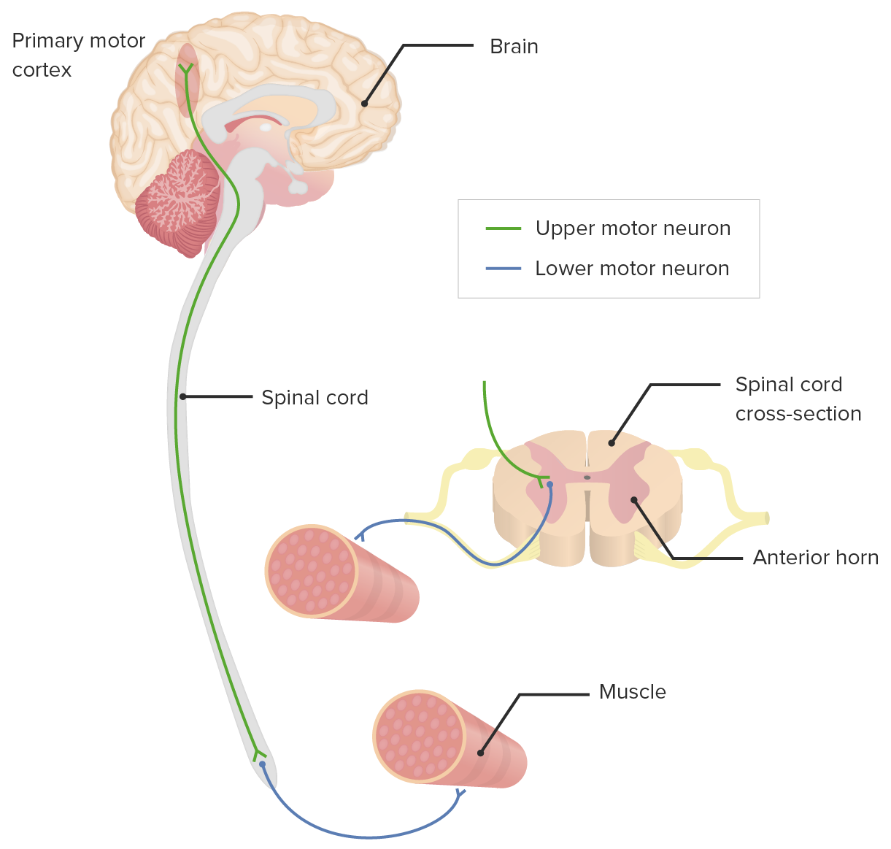

#core/appliedneuroscience

Upper motor neurons are **nerve cells in the brain that control voluntary movements and muscle tone**, and lower motor neurons are **nerve cells in the spinal cord that control the contraction of muscles.** Upper motor neurons send signals to lower motor neurons to initiate movement, and lower motor neurons use that information to control the contraction of muscles and maintain muscle tone.

## Connection to Neural Signaling Basics

The signals transmitted by upper and lower motor neurons rely on fundamental neuronal properties:

 **Resting membrane potential** ([[resting membrane potential|resting_membrane_potential.md]]): The baseline electrical state (-70mV) from which signaling begins

 **Action potential**: The all-or-none electrical signal that travels along the axon to communicate with other neurons or muscle fibers

 **Graded potentials**: Local changes in membrane potential (like [[EPSPs and IPSPs|ipsps_and_epsps.md]]) that sum to reach threshold for action potential generation

 **Ion channels** ([[ion channels|ion_channels.md]]): Proteins that allow ion flow to create electrical signals

 **Polarization changes**: [[Hyperpolarisation and depolarisation|hyperpolarisation_and_depolarisation.md]] represent shifts in membrane potential that inhibit or excite neuronal firing
