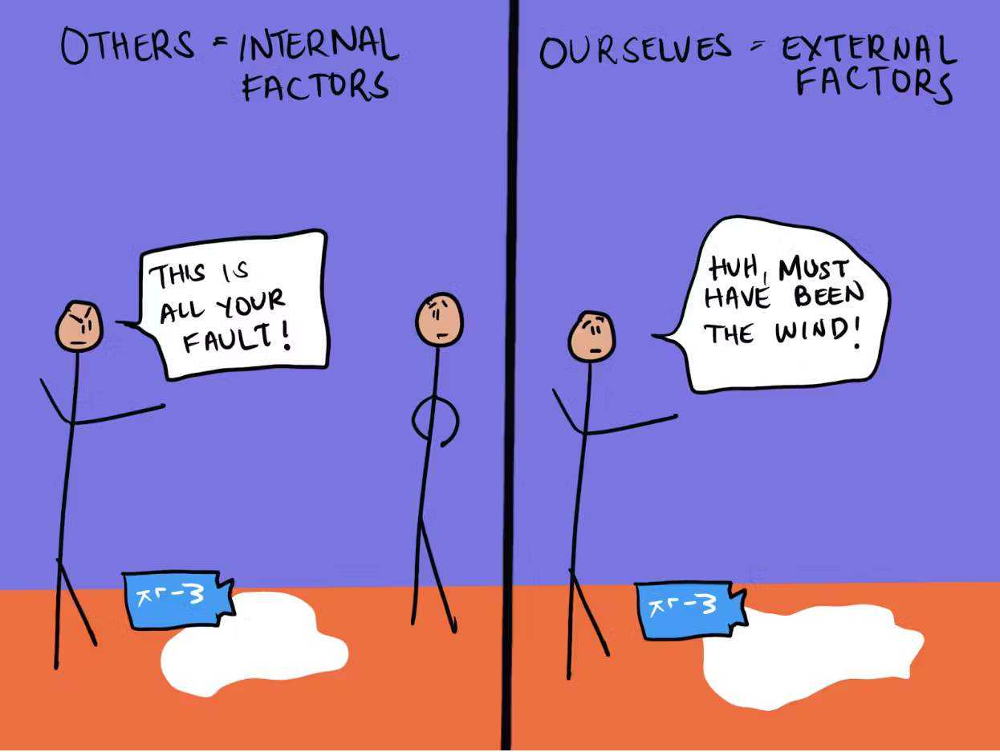

#core/appliedneuroscience 

The fundamental attribution error (FAE) is a **cognitive bias that occurs when we overestimate the influence of internal factors** (e.g., personality traits, abilities) and underestimate the influence of external factors (e.g., situational factors) on other people's behaviour.

For example, if we see someone cut us off in traffic, we might be more likely to attribute their behaviour to their personality (e.g., they're a jerk) than to the situation (e.g., they were late for work).