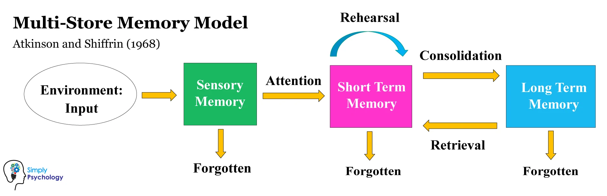

#core/appliedneuroscience 

The Modal Model of Memory is a model that explains how information is processed, stored and retrieved from memory. It was **developed by Richard Atkinson and Richard Shiffrin in 1968** and is still used today as a way to explain how memories are formed and how they can be retrieved.

**The model consists of three stages: sensory memory, short-term memory, and [long-term memory](Long-term%20memory.md).** Sensory memory is the brief storage of information from our senses, such as what we see, hear, smell, and taste. Short-term memory is the active storage of information for a short period of time. Finally, [long-term memory](Long-term%20memory.md) is the permanent storage of information. This model helps to explain how we remember and retrieve information from our memories.

## Memory Systems Overview

The modal model provides a framework for understanding how different memory systems interact:

- [Working memory model](Working%20memory%20model.md): Baddeley's elaboration of short-term memory with multiple components (phonological loop, visuospatial sketchpad, central executive)
- [Long-term memory](Long-term%20memory.md): Permanent storage subdivided into explicit (declarative) and implicit (procedural) memory
- [Flashbulb memories](Flashbulb%20memories.md): Vivid, detailed memories of emotionally significant events
- [Mood-congruent memory and mood-dependent memory](Mood-congruent%20memory%20and%20mood-dependent%20memory.md): How emotional states influence encoding and retrieval
- [Overgeneral autobiographical memory](Overgeneral%20autobiographical%20memory.md): Difficulty retrieving specific episodic memories (associated with depression)
- [Engram](../../../001_private/videos/Engram.md): The physical trace of a memory in neural tissue
