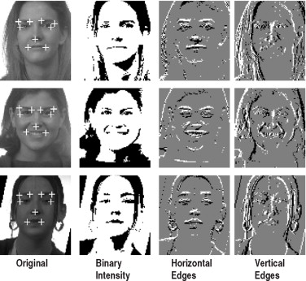

#core/appliedneuroscience #core/artificialintelligence

**Feature detector neurons** are specialised cells in the visual cortex that respond selectively to particular features of visual stimuli—edges, orientations, motion directions, and spatial frequencies—forming the elementary building blocks of visual perception.

## Hubel & Wiesel (1959–1968)

David Hubel and Torsten Wiesel's landmark single-unit recordings in cat and macaque V1, earning the **1981 Nobel Prize in Physiology or Medicine** (shared with Roger Sperry), revealed that V1 neurons are not general-purpose detectors but are tuned to specific stimulus properties. Their core insight: V1 receives spatially organised centre-surround cells from the [lateral geniculate nucleus](vision_in_the_brain.md) and recombines them into orientation-selective responses.

## Cell Types in V1

| Cell Type | Key Property | Position Sensitivity |
|-----------|--------------|---------------------|
| **Simple cells** | Respond to oriented bars/edges at a fixed retinal location; linear summation of ON/OFF subfields | Position-specific |
| **Complex cells** | Same orientation tuning but fire wherever the stimulus falls in the receptive field; often direction-selective | Position-invariant |
| **End-stopped cells** (hypercomplex) | Length-selective; respond to short oriented stimuli, inhibited by elongated contours extending beyond the receptive field | Position-invariant |

Simple cells integrate linearly arranged LGN inputs; complex cells pool across multiple simple cells, achieving translation invariance within a local region.

## Cortical Organisation

V1 is organised into **orientation columns**—adjacent neurons share orientation preference, rotating smoothly through 0°–180° across the cortical surface—interleaved with **ocular dominance columns** (left vs right eye preference). One **hypercolumn** (~1 mm²) contains a complete set of orientations and ocular dominance pairs for a single retinal point, providing a functional sampling unit for that region of visual space.

## Ventral Stream Hierarchy

Starting from [V1 via the primary visual cortex](visual_pathways.md), feature complexity escalates along the ventral ("what") stream:

- **V1** → orientation, spatial frequency, direction of motion
- **V2** → complex contours, figure-ground boundaries, texture
- **V4** → global shape, colour, moderate viewpoint invariance
- **Inferior Temporal (IT) cortex** → object identity, face recognition, high translation and scale invariance

Each stage pools over the invariances of the stage below, progressively abstracting from local pixel-level features to categorical object representations.

## Analogy to Convolutional Neural Networks

Hubel & Wiesel's architecture directly inspired the design of **convolutional neural networks (CNNs)**:

- **Convolutional layers** ≈ simple cells: local, oriented filters applied across positions
- **Pooling layers** ≈ complex cells: position invariance through spatial pooling
- **Deep hierarchy** ≈ ventral stream: the V1 → V4 → IT progression maps onto early → late network layers

Yann LeCun formalised this analogy in **LeNet (1989)**, and it was dramatically extended by Krizhevsky, Sutskever, and Hinton's **AlexNet (2012)**. Visualising CNN units trained on ImageNet reveals that early layers independently learn Gabor-like filters nearly identical to V1 simple-cell receptive fields—a convergence that was not engineered but emerges from learning on natural images.

## Relation to Visual Consciousness and the Binding Problem

Feature detectors extract fragmented local signals—but perception is unified. How the brain reassembles orientation, colour, and motion into a single coherent object is the **[feature-binding problem](../../../001_private/books/how_to_build_a_brain/massive_binding_problem.md)**. Proposed mechanisms include:

- **Gamma-band synchrony** (Wolf Singer, Andreas Engel): neurons representing the same object fire in phase-locked oscillations (~40 Hz), tagging them as belonging to a common percept
- **Recurrent feedback**: top-down connections from V4/IT back to V1 modulate early feature responses under a unified representation
- **Attention**: selective gain modulation of feature-detector outputs within a spatial region

The role of V1 feature detectors in conscious experience itself remains contested. Recurrent Processing Theory (Victor Lamme) argues that local V1 recurrent loops are sufficient for phenomenal awareness, whereas Global Workspace Theory holds that features become conscious only when broadcast to frontoparietal networks—both positions are addressed in [neural correlate of consciousness](../../../001_private/books/the_feeling_of_life_itself/neural_correlate_of_consciousness.md).
