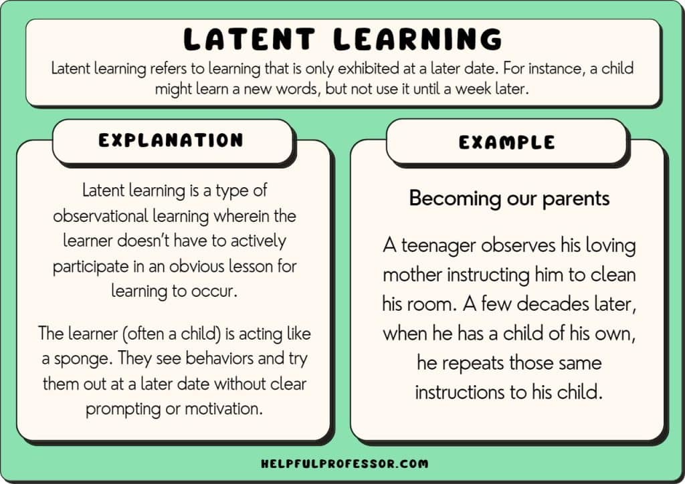

#core/appliedneuroscience

- Learning **without immediate reinforcement** or outward manifestation.
- Coined by Tolman, it challenges behaviourist theories, emphasising cognition.
- Tolman’s maze experiments showed **purposeful behaviour without prior rewards.**
- Cognitive processes, like forming mental maps, play a crucial role.
- Knowledge remains hidden until relevant situations arise.
- Latent learning provides **preparedness for future challenges.**
