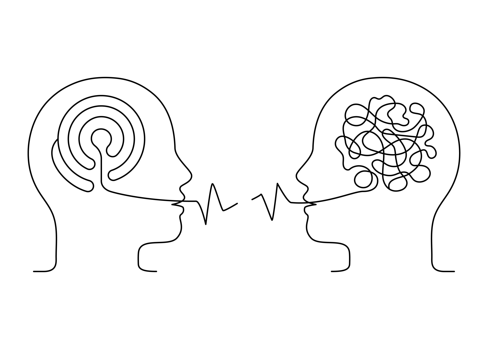

#core/appliedneuroscience

Psycholinguistics is the **scientific study of the cognitive processes involved in language comprehension, production, and acquisition**, ergo the study of the interrelation between linguistic factors and psychological aspects. It is an interdisciplinary field that draws upon theories and methods from linguistics, psychology, neuroscience, and computer science to investigate how humans learn, use, and process language.

## Core Processes

Psycholinguistic research typically investigates three interlocking processes:

- **Language comprehension** — how listeners and readers transform acoustic or visual signals into meaning. This involves lexical access (retrieving word representations from [long-term memory](long-term_memory.md)), syntactic parsing (assigning grammatical structure to incoming strings), and [semantic integration](../../../001_private/books/how_to_build_a_brain/deep_and_shallow_semantic_processing.md) (combining word meanings into propositional content). Models of comprehension must explain both the speed of processing — healthy adults parse roughly 150–300 words per minute in speech — and its incremental, predictive character.
- **Language production** — how speakers and writers convert pre-verbal intentions into articulated utterances. Levelt's (1989) _Speaking_ model remains influential, proposing a pipeline from conceptualisation through lemma selection, phonological encoding, and articulatory planning. Speech errors (e.g., spoonerisms, tip-of-the-tongue states) provide a natural window into the architecture of this pipeline.
- **Language acquisition** — how children acquire the grammar, lexicon, and pragmatic competence of their native language within a remarkably short developmental window. The nativist–empiricist debate initiated by Chomsky's (1959) review of Skinner's _Verbal Behavior_ (see [Behaviourism](behaviourism.md)) remains central: nativists argue for an innate Universal Grammar, while usage-based accounts emphasise statistical learning and social interaction.

## Neural Substrates of Language

The classical neuroanatomical model identifies two key cortical regions within the [neocortex](../../_general/neocortex.md):

- **Broca's area** (left inferior frontal gyrus, BA 44/45) — associated with speech production, syntactic processing, and verbal working memory. Paul Broca's 1861 localisation of articulate speech to this region was a landmark in [cortical](../04_biological_foundations_of_mental_health/cortical_connections.md) mapping (see also [craniotomy](../../../001_private/books/the_feeling_of_life_itself/craniotomy.md) for modern intraoperative language mapping).
- **Wernicke's area** (left posterior superior temporal gyrus, BA 22) — associated with speech comprehension and semantic processing. Damage to this region produces fluent but semantically incoherent speech (Wernicke's aphasia).

Contemporary neuroscience has largely superseded this two-region model with the **dual-stream framework** (Hickok & Poeppel, 2007), which proposes:

- A **dorsal stream** (temporal → parietal → frontal) supporting sensorimotor mapping — translating acoustic speech representations into articulatory motor programmes via the [association fibres](../04_biological_foundations_of_mental_health/association_fibres.md) of the arcuate fasciculus.
- A **ventral stream** (temporal → anterior temporal → inferior frontal) supporting the mapping of sound to meaning — lexical-semantic processing distributed across the temporal lobe.

Language is strongly lateralised to the left hemisphere in most right-handed individuals, though right-hemisphere contributions (prosody, discourse-level processing, pragmatic inference) are increasingly recognised. Cases of [hemispherotomy](../../../001_private/books/sizing_up_consciousness/hemispherotomy.md) illustrate both the extent and limits of language lateralisation and reorganisation.

## Key Theories and Models

- **Modular vs interactive processing**: Fodor's (1983) modularity hypothesis proposes that language processing is encapsulated — syntactic parsing proceeds independently of semantic or pragmatic context. Constraint-based models, by contrast, argue that all available information (lexical, syntactic, semantic, pragmatic) is integrated in parallel from the earliest moments of processing.
- **Connectionist (PDP) models**: Parallel distributed processing approaches model language as emergent from patterns of activation across neural networks, rather than from symbolic rules. These models account well for gradient phenomena such as [semantic priming](../../../001_private/books/short_introduction_to_memory/priming.md) and frequency effects.
- **Predictive processing**: More recent accounts frame comprehension as prediction — the brain generates top-down expectations about upcoming input and processes primarily the prediction error. The [N400 component](../06_neuroimaging_in_mental_health/event-related_potential.md) of event-related potentials, which is sensitive to semantic expectancy, is a key empirical signature of this predictive mechanism.

## Language Acquisition and Critical Periods

Children achieve near-adult grammatical competence by age 5–6 despite limited and noisy input — Chomsky's "poverty of the stimulus" argument. Whether this reflects innate grammatical knowledge or powerful domain-general statistical learning mechanisms remains contested.

The [critical period hypothesis](../04_biological_foundations_of_mental_health/hebbian_synaptic_plasticity.md) (Lenneberg, 1967) proposes that there is a biologically determined window during which language acquisition proceeds most efficiently. Evidence from cases of extreme deprivation (e.g., Genie) and second-language acquisition research supports a gradual decline in acquisition capacity after puberty, likely mediated by maturational changes in [synaptic plasticity](../04_biological_foundations_of_mental_health/hebbian_synaptic_plasticity.md). The role of language in structuring early memory is also reflected in accounts of [infantile amnesia](../../../001_private/_general/infantile_amnesia.md).

## Experimental Methods

- **Reaction time paradigms**: Lexical decision tasks and naming tasks measure the speed of lexical access; [priming](../../../001_private/books/short_introduction_to_memory/priming.md) manipulations reveal the structure of semantic and phonological representations.
- **Eye-tracking**: The visual world paradigm tracks eye movements to objects as participants listen to spoken sentences, revealing the time-course of incremental parsing and reference resolution.
- **Electrophysiology**: [Event-related potentials](../06_neuroimaging_in_mental_health/event-related_potential.md) such as the N400 (semantic anomaly), P600 (syntactic repair), and LAN (left anterior negativity; morphosyntactic violation) provide millisecond-level temporal resolution of language processing stages.
- **Neuroimaging**: fMRI and PET localise language processing to specific cortical regions, while lesion studies continue to inform models of language breakdown in aphasia.

## Relation to Working Memory

The [phonological loop](working_memory_model.md) component of Baddeley's [working memory model](working_memory_model.md) is directly relevant to psycholinguistics: it provides the short-term buffer for maintaining verbal material during comprehension and production. The capacity limitations of working memory constrain sentence processing — garden-path sentences and centre-embedded relative clauses are difficult precisely because they tax the phonological loop and central executive.

## Connection to Consciousness Studies

Language occupies a contested position in theories of consciousness. Global workspace theory (Baars, 1988) treats language as a vehicle for broadcasting information into conscious awareness, while higher-order theories propose that linguistic self-report is the primary evidence for — and perhaps constitutive of — conscious experience. The question of whether pre-linguistic infants or non-human animals possess phenomenal consciousness without language remains one of the hardest problems at the intersection of [cognitive psychology and cognitive neuroscience](cognitive_psychology_vs_cognitive_neuroscience.md). For computational approaches, understanding how language grounds meaning in sensorimotor experience is also central to [neural blackboard architectures](../../../001_private/books/how_to_build_a_brain/neural_blackboard_architectures.md) and broader efforts to model cognition.
