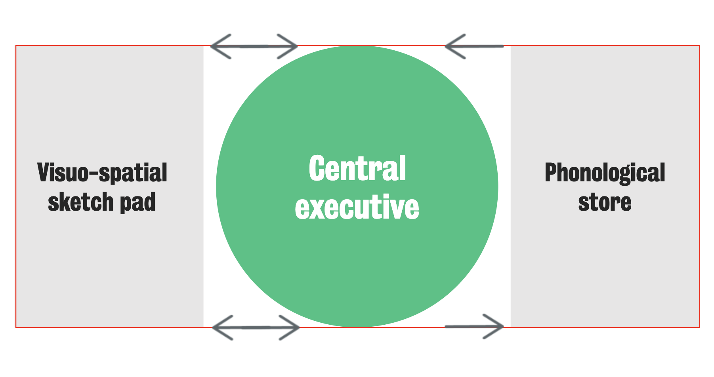

#core/appliedneuroscience

The **working memory model**, proposed by Baddeley and Hitch in 1974, describes short-term memory not as a single passive store but as a **multi-component system for temporary storage *and* active manipulation* of information**. It replaced the unitary short-term memory of the [modal model of memory](modal_model_of_memory.md) with an architecture that separates verbal, visual, and executive processing — and, in its 2000 revision, adds an integrative buffer linking working memory to [long-term memory](long-term_memory.md).

## Components

- **Phonological loop** — stores and rehearses verbal/auditory information. Comprises a brief phonological store (~1–2 seconds) and an articulatory rehearsal process that refreshes it; explains the **word length effect** (short words recalled better than long ones).
- **Visuospatial sketchpad** — stores and manipulates visual and spatial information. Subdivided into a **visual cache** (passive store of form/colour) and an **inner scribe** (active spatial manipulation).
- **Central executive** — a domain-general **attentional controller** that allocates resources and coordinates the subsystems. It is not itself a modality-specific storage buffer.
- **Episodic buffer** (added 2000) — a **limited-capacity** temporary store that binds information from the phonological loop, visuospatial sketchpad, and long-term memory into integrated episodes, providing the bridge between working and [long-term memory](long-term_memory.md).

> [!tip] Key evidence
> **Dual-task interference** — performance drops when two tasks compete for the same subsystem (e.g. tracking a visual target while retaining verbal material is spared, but two verbal tasks interfere). **Articulatory suppression** — repeating irrelevant speech blocks subvocal rehearsal, eliminating the phonological loop's advantage. The model is central to [psycholinguistics](psycholinguistics.md) and accounts for verbal rehearsal, reading comprehension, and reasoning.
