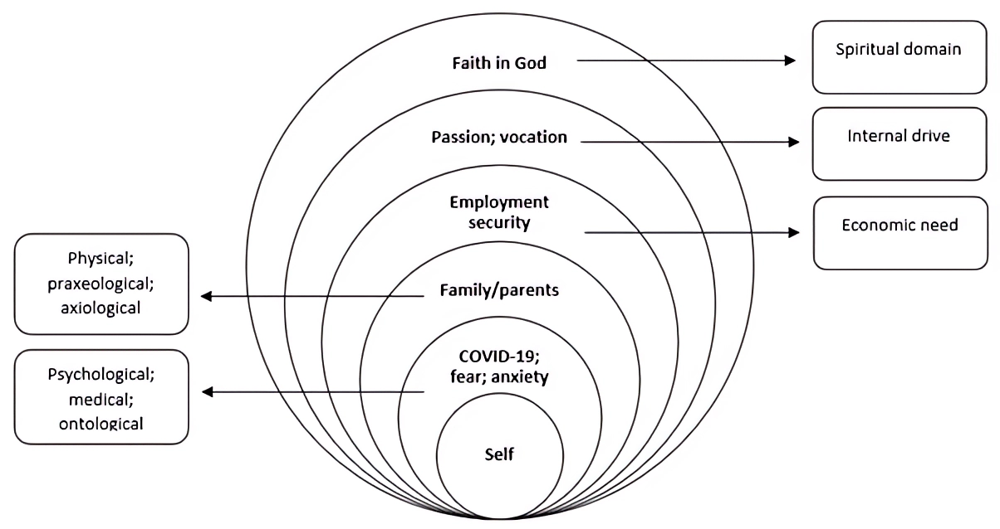

#core/appliedneuroscience #core/syntheticphenomenology

Phenomenology is a branch of philosophy that **studies the structure of experience and consciousness.** It focuses on understanding **how people experience the world and how their experiences shape their understanding of the world.** It is concerned with the subjective aspects of experience—how people perceive, interpret, and remember events—and the **relationship between the individual and the world, including how people interact with and make sense of their environment.** Phenomenology is closely related to other philosophical disciplines such as existentialism, [hermeneutics](../../../001_private/_general/hermeneutics.md), and existential psychology.

## Key Figures

- **Edmund Husserl** (1859–1938): Founder of phenomenology. Introduced the concept of **intentionality**—that consciousness is always directed at something—and the method of **bracketing** (epoché), suspending natural assumptions to examine experience directly.
- **Martin Heidegger** (1889–1976): Extended phenomenology to examine **being-in-the-world**, emphasising how human existence is always situated within a context of practical engagement.
- **Maurice Merleau-Ponty** (1908–1961): Developed **embodied phenomenology**, arguing that perception and consciousness are fundamentally rooted in bodily experience—informing contemporary research into the [minimal self](../../../001_private/videos/minimal_self.md).
- **Karl Jaspers** (1883–1969): Applied phenomenology to psychiatry, establishing **descriptive psychopathology**—the careful first-person characterisation of psychotic and affective experience that underpins modern diagnostic systems.
- **Dan Zahavi** (b. 1967): Contemporary figure bridging Husserlian phenomenology and cognitive neuroscience, advocating **intersubjectivity** and rigorous first-person methods in consciousness science.

## Core Concepts

### Intentionality

Every conscious act is directed at an object—perception is always perception *of* something, thought is always thought *about* something. Husserl's intentional analysis decomposes each act into [noesis and noema](../../../001_private/articles/noesis_and_noema.md): the act of experiencing (noesis) and its intentional content or object (noema).

### Epoché and Phenomenological Reduction

The **epoché** (or phenomenological bracketing) temporarily suspends the *natural attitude*—the default assumption that the world exists independently of experience—in order to examine the structure of experience itself. The **eidetic reduction** then abstracts invariant structural features (essences) across variations of a phenomenon.

### Lifeworld (*Lebenswelt*)

Husserl's late concept of the **Lebenswelt** denotes the pre-theoretical world of lived experience that underlies all scientific abstraction. It positions phenomenology as foundational to any empirical science of mind or behaviour, and situates cognitive science within a horizon it can never fully escape.

## Branches

| Branch | Key Figure | Central Concern |
|:---|:---|:---|
| Transcendental | Husserl | Pure structure of consciousness; epoché and reduction |
| Existential | Heidegger, Sartre | Being-in-the-world; temporality and authenticity |
| Embodied | Merleau-Ponty | Perception as irreducibly bodily; motor intentionality |
| Social | Schütz, de Beauvoir | Intersubjectivity; gendered and cultural experience |
| Psychiatric | Jaspers, Fuchs | Descriptive psychopathology; altered temporality in depression and psychosis |

## Phenomenology in Mental Health

Phenomenological psychiatry, established by **Karl Jaspers** in *General Psychopathology* (1913), treats patient reports not merely as symptoms to classify but as windows into altered structures of experience. Key applications include:

- **Depression**: Phenomenological analysis reveals disturbed **time-experience** (an oppressive, frozen present) that precedes mood symptoms—studied empirically by Thomas Fuchs via the Temporal Experience of Pleasure Scale.
- **Schizophrenia**: Core disruption of **ipseity** (the minimal pre-reflective sense of self-presence), experienced as loss of ownership over one's own thoughts (passivity phenomena such as thought insertion).
- **Clinical tool**: The **EASE** (Examination of Anomalous Self-Experience) captures experiential shifts that standard rating scales miss, enabling differential diagnosis in borderline psychotic presentations.

## Connection to Consciousness Studies

Phenomenology provides methodological tools for studying [subjective experience](../../../001_private/videos/access_and_phenomenal_consciousness.md) and the qualitative character of mental life. The **hard problem** of consciousness—why physical processes give rise to qualitative experience at all—is precisely a phenomenological puzzle; the [inverted spectrum problem](../../../001_private/videos/yoneda_lemma_and_the_inverted_spectrum_problem.md) illustrates its depth by asking whether two physically identical observers might inhabit systematically different qualia.

The challenge of bridging first-person phenomenological description with third-person neuroscience is addressed by [naturalisation of phenomenology](../../../001_private/articles/naturalisation_of_phenomenology.md), which integrates phenomenological insights with empirical research. Frameworks such as [Integrated Information Theory](../../../001_private/videos/integrated_information_theory.md) attempt to formalise phenomenological axioms (unity, intrinsicality, informativeness) as mathematical constraints on a consciousness metric. The question of whether functional equivalence guarantees experiential equivalence connects to debates about [philosophical zombies](../../../001_private/_general/philosophical_zombies.md).

## Role in Consciousness Engineering

Phenomenology is the **methodological cornerstone** of [consciousness engineering](../../../001_private/_general/consciousness_engineering.md): any attempt to preserve, transfer, or synthesise conscious experience must first characterise what that experience *is* from the inside. Phenomenological rigour constrains which substrate transitions could count as identity-preserving, directly framing the design challenge of [progressive synthetic neural substrate transfer](../../../001_private/_general/psnst.md). Without a first-person account of what is being preserved, engineering criteria reduce to behavioural mimicry—the philosophical zombie problem in applied form.
