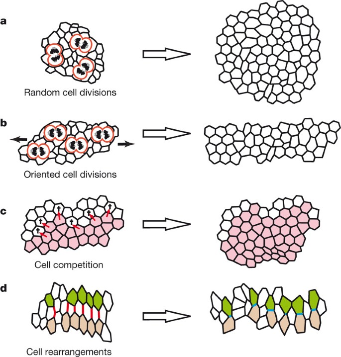

#core/appliedneuroscience 

Morphogenesis refers to the **biological process by which organisms develop their shape, form, and structures during embryonic development.** It involves various cellular and molecular mechanisms that regulate cell differentiation, migration, proliferation, and tissue organisation. These processes are tightly controlled and coordinated to generate the complex structures and patterns observed in living organisms.