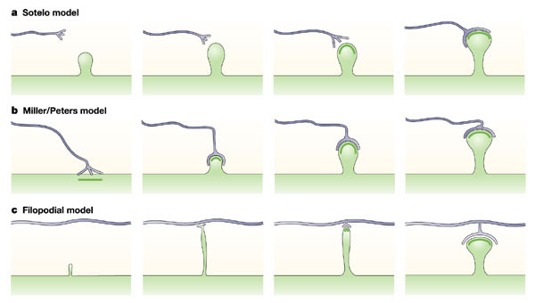

#core/appliedneuroscience

Spinogenesis is the **process of forming new [dendritic spines](dendritic_spines.md),** which are tiny protrusions from a neuron’s dendrite that receive input from a single axon of another neuron.

## Key Features

- Spinogenesis is critical for brain development and [synaptic plasticity](synaptic_plasticity.md).
- The formation of new spines is associated with strengthening synaptic connections and is necessary for certain types of learning and memory.
