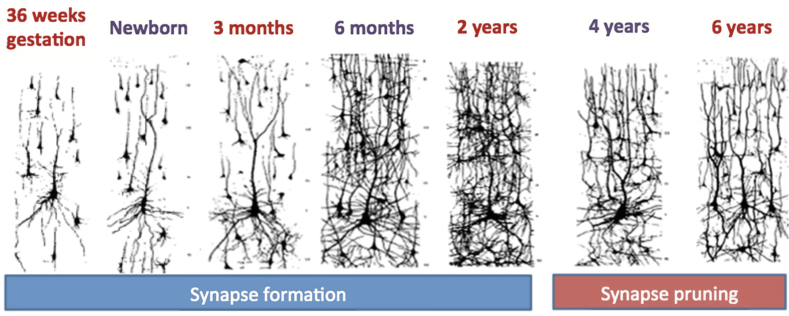

#core/appliedneuroscience 

## Synapse Pruning

-  Synapse pruning is a process in brain development that eliminates weaker or unnecessary synaptic connections.
-  It is a crucial mechanism for refining and optimising the brain's neural circuitry.
-  During early brain development, there is an overproduction of synapses, and pruning helps to eliminate excess connections.
-  Synapse pruning is influenced by various factors such as neural activity, experience, and genetic factors.
-  It plays a significant role in shaping neural circuits' functional connectivity and specificity.

---

## [Apoptosis](../08_advances_in_neuroscience/apoptosis.md)

-  [Apoptosis](../08_advances_in_neuroscience/apoptosis.md), also known as programmed cell death, is a natural and controlled process of cell elimination.
-  It is crucial for removing unwanted or damaged cells, maintaining tissue homeostasis, and sculpting developing organs.
-  [Apoptosis](../08_advances_in_neuroscience/apoptosis.md) can be triggered by internal cellular signals or external factors, such as DNA damage, cell [stress](../03_mental_health_in_the_community/stress.md), or lack of survival signals.
-  In the brain, [apoptosis](../08_advances_in_neuroscience/apoptosis.md) eliminates excessive or improperly connected neurons during development.
-  Apoptotic cell death is a carefully regulated process involving a series of molecular events, including the activation of specific proteins and fragmentation of the cell into apoptotic bodies.

*Note: Synapse pruning and [apoptosis](../08_advances_in_neuroscience/apoptosis.md) are dynamic processes that occur during different stages of brain development, contributing to the refinement and organisation of neural circuits.*