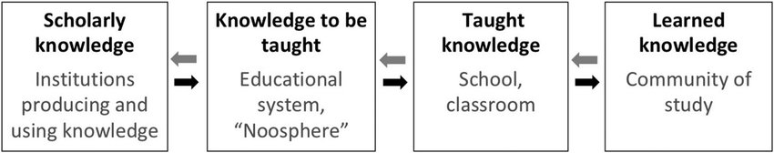

#core/appliedneuroscience

Didactic Transposition refers to the **process of transforming “knowledge” into “knowable” and “taught” content.** Yves Chevallard, a French researcher in mathematics education, originally proposed it. The concept is used to explain the changes that occur when knowledge is adapted from the domain of scholars to the school context.

## Stages of Didactic Transposition

Didactic Transposition typically involves two major stages:

1. **Prima Facie Transposition**: The original knowledge (usually complex and abstract) is simplified and transformed into a format that can be taught.
2. **Secondary Transposition**: The already transformed knowledge is further moulded to fit into specific educational contexts, considering things like the curriculum, textbooks, teaching methods, etc.

> [!example]
> Let’s take the example of the theory of relativity, a complex concept in physics:
> 1. **Prima Facie Transposition**: The abstract and complex theory of relativity is transformed into a basic principle - “The laws of physics are the same for all observers in uniform motion relative to one another (principle of relativity)”. This simplified version is more understandable for students who are new to the subject.
> 2. **Secondary Transposition**: This simplified version is then integrated into the physics curriculum in an age-appropriate manner. It might be introduced through thought experiments like the “twin paradox” for high school students. For university students, it might be taught through more formal mathematical models and more complex scenarios.
