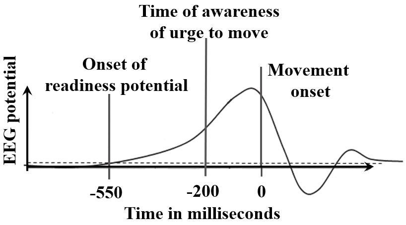

#core/appliedneuroscience

Readiness [Potential](../04_biological_foundations_of_mental_health/graded_potential.md) (RP), also known as Bereitschaftspotential, is a **brain signal that precedes voluntary movements.** It is related to the preparation or intention to perform an action.

## Overview

- **First identified:** In the 1960s by Kornhuber and Deecke
- **Electroencephalography (EEG):** It’s typically detected via EEG, a neuroimaging technique that measures electrical activity in the brain
- **Time frame:** RP can occur anywhere from 500 milliseconds to 2 seconds before the conscious decision to move

## Characteristics

- **Two main parts:** RP is often divided into two parts: the early RP (starting ~1.5 seconds before the movement) and the late RP (starting ~400 milliseconds before the movement)
- **Location:** More prominent in the supplementary motor area (SMA) and the pre-SMA of the brain
- **Function:** Suggested to reflect the preparatory processes that facilitate voluntary movement

## Controversy

### The Free Will Debate

The discovery of RP has sparked significant debate on free will, as it appears to demonstrate that our brains decide to move before we're consciously aware of the decision.

#### Libet's Original Experiments

In the 1980s, Benjamin Libet conducted pioneering experiments where participants performed simple movements (e.g., wrist flexion) while their brain activity was monitored via EEG. He found:

- **Readiness Potential (RP)**: Measurable brain activity begins ~550ms before the movement
- **Conscious Awareness**: Participants became consciously aware of their intention to move only ~200ms before the action

This temporal ordering—unconscious brain preparation *before* conscious intention—challenged the intuitive notion that we consciously initiate our voluntary actions.

#### Interpretations

The findings have been interpreted in competing ways:

| Position | Claim | Implication for Free Will |
|----------|-------|--------------------------|
| **Hard Determinism** | RP proves all actions are causally determined by unconscious brain processes | No free will—conscious awareness is merely a post-hoc narrative |
| **Compatibilism** | Free will is compatible with unconscious neural preparation | Conscious veto capability preserves agency |
| **Libertarian Free Will** | The conscious mind can override unconscious preparation | Some decisions originate from conscious will |

#### The "Free Won't" Response

Libet proposed that while we may not consciously *initiate* actions, we retain the ability to consciously *veto* or inhibit them in the final moments before execution—termed **[conscious veto](09_research_ethics_to_reviewing_and_critical_analysis/conscious_veto.md)** or "free won't." This capability, he argued, preserves a meaningful role for conscious will in controlling our actions.

#### Ongoing Debate

The controversy remains unresolved:

- **Dual-process theories** now suggest [volition](../../../001_private/papers/volition.md) involves both automatic (unconscious) and controlled (conscious) processes operating at different timescales
- **Critics** argue Libet's paradigm (simple movements in lab settings) doesn't generalise to complex, deliberate decisions
- **Philosophers** continue debating whether conscious veto is sufficient for genuine free will or merely an illusion of control

See also: [Volition](volition.md), [Conscious Veto](09_research_ethics_to_reviewing_and_critical_analysis/conscious_veto.md), [Philosophical Zombies](philosophical_zombies.md)

## Current Research

- **Prediction of movement:** Researchers are exploring how RP can be used to predict movement, which could be particularly useful in neuroprosthetics
- **Understanding cognitive processes:** RP is also studied to further understand cognitive processes related to the planning and initiation of actions
