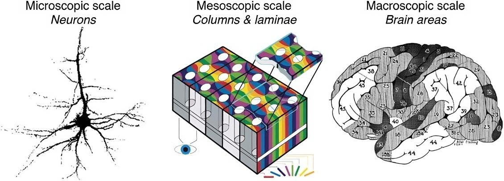

#core/appliedneuroscience

The neuronal organisation **can be understood at various scales, each providing insights into different aspects of brain function and structure.** The classification into microscopic, mesoscopic, and macroscopic scales helps dissect the complexity of the brain from the level of individual neurons to large networks of brain regions.

## Microscopic [Scale](../../../001_private/videos/Decoupling%20of%20scale.md)

- **Definition**: Focuses on the individual neurons and their components, such as dendrites, axons, synapses, and molecular pathways.
- **[Techniques](Neuroimaging%20analysis%20techniques.md)**: Utilises histology, electron microscopy, and single-cell imaging. Recent advancements include two-photon microscopy and [optogenetics](../../../001_private/social-media/linkedin/Optogenetics.md).
- **Relevance**: Essential for understanding the cellular and molecular basis of neural function, including neurotransmission, [neurogenesis](../04%20Biological%20Foundations%20of%20Mental%20Health/Neurogenesis.md), and [synaptic plasticity](../04%20Biological%20Foundations%20of%20Mental%20Health/Synaptic%20plasticity.md).

## Mesoscopic Scale

- **Definition**: Bridges the microscopic and macroscopic by focusing on local circuits and small networks of neurons within specific brain regions.
- **Techniques**: Includes techniques like calcium imaging, tract tracing, and some forms of magnetic resonance imaging (MRI) that provide insights into the connectivity and function of local neural circuits.
- **Relevance**: Critical for understanding how groups of neurons interact to process information and how local circuitry contributes to specific brain functions and behaviours.

## Macroscopic Scale

- **Definition**: Encompasses large-scale brain networks and interactions among different brain regions.
- **Techniques**: Employs neuroimaging methods such as fMRI, PET, and EEG, which reveal patterns of brain activity and connectivity across the whole brain.
- **Relevance**: Important for understanding higher-level functions like cognition, emotion, and consciousness. It helps in mapping brain activity to psychological states and behaviours.
