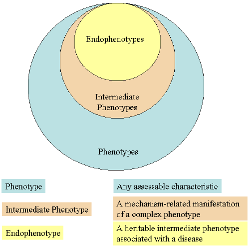

#core/appliedneuroscience

**Endophenotypes are measurable biomarkers or traits that are thought to be closer to the genetic origins of a disorder than the clinical symptoms themselves.** They serve as a bridge between the observable phenotype and the underlying genotype. They’re often used in psychiatric and neurological research to understand complex disorders like schizophrenia, bipolar disorder, and ADHD.

## Characteristics

- **Heritable**: [Endophenotypes](../06_neuroimaging_in_mental_health/biomarker_and_neuromarker.md#types) are genetic in nature and can be passed from parents to offspring.
- **Associated with Illness**: They are associated with a specific disorder in the population.
- **State-Independent**: Present in an individual regardless of whether the illness is active.
- **Found in Non-Affected Family Members**: This may also be present in family members who do not meet the criteria for the disorder, suggesting a genetic, not environmental, cause.
- **Specific to an Illness**: Ideally, an endophenotype should be specific to one illness or a group of related disorders.

## Examples

- **Cognitive Deficits**: Such as impairments in working memory or attention that are common in psychiatric disorders.
- **Neurophysiological [Markers](../06_neuroimaging_in_mental_health/biomarker_and_neuromarker.md#biomarkers)**: Like abnormal brain wave patterns observed in EEG.
- **Biochemical Markers**: Including variations in neurotransmitter levels.
- **Neuroanatomical Features**: Such as differences in brain structure size or connectivity observed through MRI.
