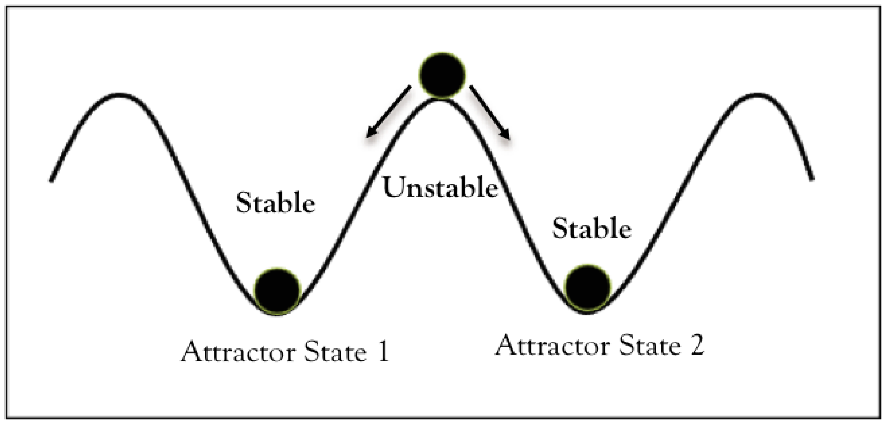

#core/appliedneuroscience #core/artificialintelligence

An attractor state refers to a **set of points in the [phase space](phase_space_and_phasing_rotator.md) toward which a system tends to evolve**, regardless of its initial state. This concept is crucial in understanding the stable and recurrent patterns in neural signal processing.

## Definition of Attractor State

- **Attractors** are stable states or sets of states that a dynamic system approaches over time. These can be points, cycles, or more complex structures.

## Types of Attractors

- **Point Attractors**: Represent a stable equilibrium state where the system settles into a single steady state.
- **Limit Cycles**: Denote periodic orbits; the system returns to the same trajectory after a period.
- **Chaotic Attractors**: Indicate irregular yet bounded trajectories, leading to deterministic but unpredictable behaviour.

## Application in Neural Signal Processing

- **Modeling Neural Dynamics**: Attractors are used to model how neural circuits stabilise to a particular function or behaviour, such as memory or pattern recognition. The **Hopfield network** (1982) is the classic computational model: stored patterns act as point attractors, and content-addressable retrieval corresponds to the system settling into the nearest attractor basin from a partial or noisy cue.
- **Understanding Neural Connectivity**: Attractor dynamics can help explain how neural networks achieve synchronisation and how different neural states are maintained. In [physical reservoir computing](../../../001_private/social-media/x/physical_reservoir_computing.md), the echo state property — where dynamics asymptotically wash out initial conditions — is a direct instance of attractor-based computation.
- **Signal Classification**: Identifying attractor states in neural signals can help distinguish between different cognitive states or diagnose neurological conditions.
- **Decision-Making Circuits**: Competing attractor states represent alternative choices in prefrontal cortex; the system bifurcates toward one attractor as evidence accumulates, with the bifurcation point constituting the moment of decision commitment.

Attractor dynamics produce deterministic yet sometimes unpredictable behaviour. In chaotic regimes, this connects to [computational irreducibility](../../../001_private/videos/computational_irreducibility.md): the only way to discover the system's trajectory is to simulate it — no shortcut exists, even when the attractor's governing equations are known.
