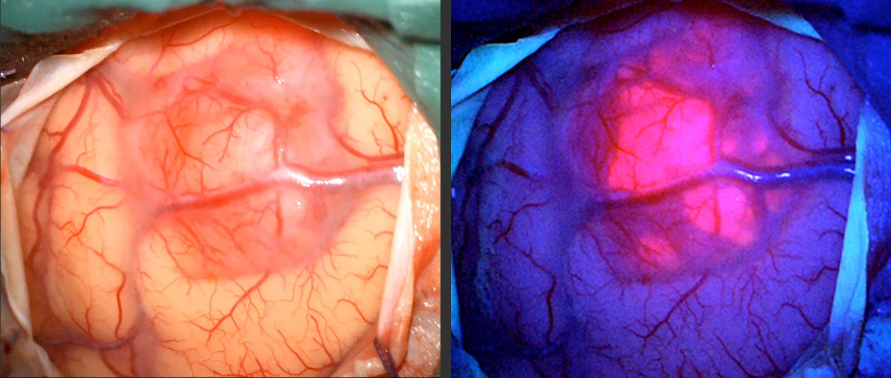

#core/appliedneuroscience 

The Pink Drink technique is used to **enhance the visualisation of malignant glioma (brain tumour) tissue during surgery.** The patient consumes a solution containing 5-aminolevulinic acid (5-ALA) prior to the procedure. This approach allows surgeons to more effectively distinguish tumour tissue from normal brain tissue, ultimately aiding in safer and more complete tumour removal.

## Mechanism

- 5-ALA is preferentially taken up and metabolised by glioma cells.
- Tumor cells convert 5-ALA into a fluorescent compound (protoporphyrin IX).
- Under a specific wavelength of blue or ultraviolet light, tumour tissue **glows pink/orange**, while normal brain tissue does not.

## Surgical Application

- Surgeons use a special light source (blue/violet) and filters during the operation.
- The fluorescence helps differentiate tumour from healthy brain tissue.
- Enables more complete and safer tumour removal.

## Other Names

- 5-ALA–guided surgery
- Fluorescence-guided resection (FGR)
- "Pink Drink" method
- Brand name for 5-ALA solution: **Gleolan**

## Indications

- Primarily used for **high-grade gliomas** (e.g., glioblastoma multiforme).
- Useful when tumour boundaries are hard to distinguish under normal light.

## Key Points to Remember

- **5-ALA**: Oral solution, taken a few hours before surgery.
- **Fluorescence**: Tumor glows under blue/violet light, aiding resection.
- **Goal**: Maximise tumour removal, minimise damage to healthy tissue.