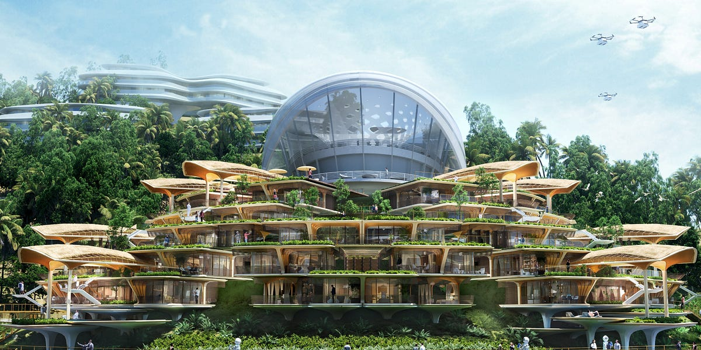

#lead/ventureengineering #fundamental/communication

**Infinita (formerly Vitalia) is a pop-up "longevity city" inside the Próspera ZEDE on Roatán, Honduras — a live test case for charter-city venture engineering.**

## Honduras

- **What**: Central American nation with Caribbean/Pacific coastlines.
- **Key Features**:
  - Economy: agriculture (coffee, bananas), textiles, and tourism.
  - Created **ZEDEs** (special economic zones) in 2013 to attract foreign investment.
  - Repealed the ZEDE law in April 2022, creating uncertainty for projects like Próspera.

## Roatán

- **What**: Largest of Honduras' Bay Islands in the Caribbean.
- **Role**:
  - Tourism hub (Mesoamerican Barrier Reef diving) and conservation focus.
  - Hosts **Próspera ZEDE** — a semi-autonomous economic zone.

## Próspera ZEDE

- **What**: Private-public partnership and ZEDE on Roatán, established 2017.
- **Key Features**:
  - Operates under the Honduran constitution with autonomous governance.
  - Business-friendly: residency fees historically $260–$1,300/year (repriced to ~$130/year in 2024), a common-law-style contract regime influenced by US law, and Bitcoin as legal tender and unit of account within the zone (since 2022).
  - ~$120M raised, reportedly via Pronomos Capital and funds backed by Peter Thiel and Marc Andreessen — though Próspera disputes direct billionaire backing.
  - Controversies: criticised as a "corporate monarchy" with limited local democratic input.

## Infinita (previously Vitalia) City

- **What**: Pop-up "longevity city" within Próspera, first hosted January–March 2024.
- **Purpose**:
  - Accelerate biotech research (e.g., gene therapies) using Próspera's flexible regulations.
  - Hosted conferences on AI/crypto with 30+ participants in shared workspaces.
  - Seen as a test case for Próspera's model of temporary innovation communities; later rebranded Infinita.

## Connections

| Entity   | Relationship                                                            |
| -------- | ----------------------------------------------------------------------- |
| Honduras | Sovereign state hosting Roatán and authorising ZEDEs                    |
| Roatán   | Physical location for Próspera ZEDE and Vitalia                         |
| Próspera | ZEDE using Roatán's land; provides legal framework for Vitalia          |
| Vitalia  | Experimental project leveraging Próspera's deregulated environment      |

> [!info] **Economic Chain**
> Honduras seeks FDI → Roatán diversifies beyond tourism → Próspera offers tax/regulatory incentives → Vitalia tests cutting-edge biotech models.
