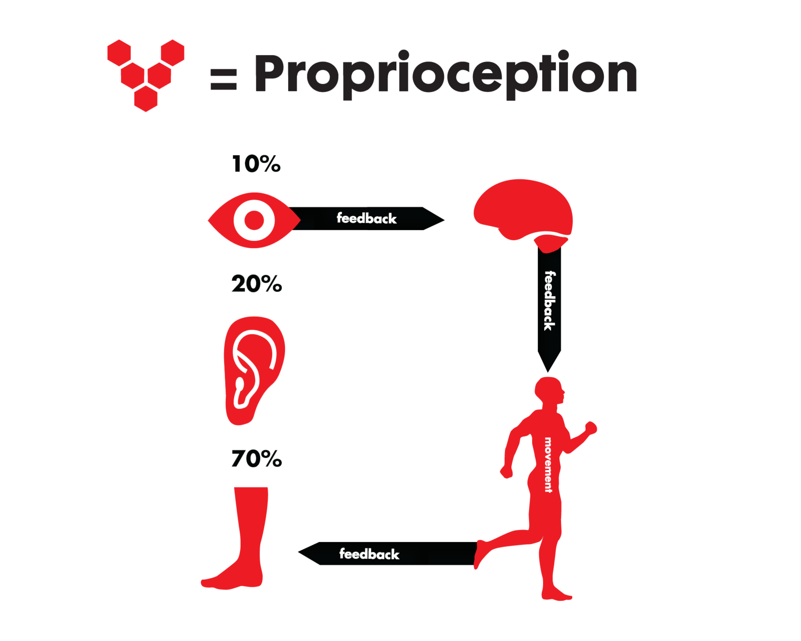

#core/appliedneuroscience

Proprioception is the **sense of position and movement of our limbs and muscles** — often called the body's "sixth sense". It permits us to move effortlessly without needing to look at what each body part is doing. For instance, even **with our eyes closed, we're able to touch our nose with a finger** due to proprioception. Proprioceptive signals are carried to the CNS by the [peripheral nervous system](peripheral_nervous_system.md).

## Receptors

1. **Muscle Spindles**: Located within the muscle fibres, they sense muscle stretch and the speed of the stretch, providing information about muscle length and velocity of movement.
2. **Golgi Tendon Organs**: Found in tendons, the tissue connecting muscle to bone. They respond to muscle tension and the rate of tension development, providing a sense of force.
3. **Joint Capsule Receptors**: Provide information about joint angle and joint movement, contributing to the sense of the position of the body and its parts.

## Sensory Contributions to Balance

Postural control and movement feedback draw on three sensory systems (see diagram):

- **~70% somatosensory/proprioceptive** — the dominant input, arising largely from the feet and legs.
- **~20% vestibular** — from the inner ear.
- **~10% visual** — from the eyes.

## Pathways

- **Conscious proprioception**: Travels via the dorsal column–medial lemniscus pathway to the somatosensory cortex, giving awareness of body position.
- **Unconscious proprioception**: Travels via the spinocerebellar tracts to the cerebellum, enabling automatic coordination and balance.

## Clinical Relevance

- Proprioceptive loss (e.g., from peripheral neuropathy or dorsal column damage) causes **sensory ataxia** — uncoordinated movement that markedly worsens with the eyes closed (positive Romberg sign).
