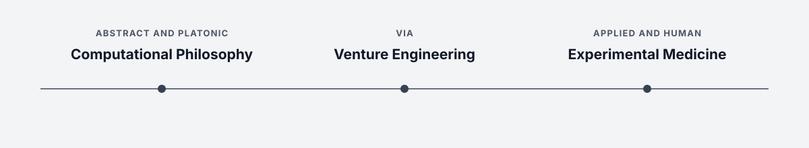

## Public Notes

This is my public, Obsidian-based [Zettelkasten](https://en.wikipedia.org/wiki/Zettelkasten): a working knowledge base for learning across disciplines, connecting them, and turning those connections into research, engineering, and new intellectual frameworks.

The notes bring together personal study, professional work, formal education, subsidiary projects, and public communication. This breadth reflects my aim to become a modern-day [polymath](https://en.wikipedia.org/wiki/Polymath): to develop depth across disciplines and, more importantly, build bridges between them. **Browse the website version of this repository here: [https://publish.obsidian.md/danburonline](https://publish.obsidian.md/danburonline)**

### Skill Architecture

I organise my skills in three layers: lead disciplines synthesise and direct my work, core disciplines provide depth, and fundamental skills underpin how I communicate, create, and reason.

#### 1. Lead

Lead skills are the highest level of synthesis. These three leads form a continuum from abstract knowledge to direct intervention in living systems:

- #lead/computationalphilosophy
- #lead/venturescience
- #lead/experimentalmedicine

#### 2. Core

Core skills are deep disciplinary competencies. Each can stand on its own, while their combinations make lead-level synthesis possible.

- #core/evolutionarypanmemetics
- #core/syntheticphenomenology
- #core/biomimeticneuromorphics
- #core/mathematicalphysics
- #core/theoreticalneurosurgery
- #core/appliedneuroscience
- #core/artificialintelligence
- #core/softwaredevelopment
- #core/interactiondesign

#### 3. Fundamental

Fundamental skills are the personal capacities beneath every discipline. They shape how I reason, create, and communicate.

- #fundamental/communication
- #fundamental/creativity
- #fundamental/logic
