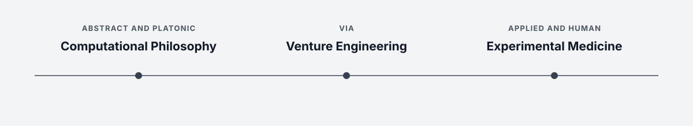

## Public Notes

This is my public, Obsidian-based [Zettelkasten](https://en.wikipedia.org/wiki/Zettelkasten): a knowledge base for enduring ideas across disciplines. I use it to build bridges between fields, supporting my aim to become a modern-day [polymath](https://en.wikipedia.org/wiki/Polymath) and turn learning into research, engineering and new intellectual frameworks. **[Browse the website version](https://danbur.online/notes).**

### Vision and Mission

Two overarching ontological entities orient the work documented here:

- **Vision:** synthetic consciousness
- **Mission:** hybrid mind uploading

### Skill Architecture

I organise my skills in three layers: lead disciplines synthesise and direct my work, core disciplines provide depth, and fundamental skills underpin how I communicate, create, and reason. Individual notes can carry multiple tags when they substantively connect more than one of these areas.

#### 1. Lead

Lead skills are the highest level of synthesis. These three leads form a continuum from abstract knowledge to direct intervention in living systems:

- #lead/computationalphilosophy
- #lead/ventureengineering
- #lead/experimentalmedicine

#### 2. Core

Core skills are deep disciplinary competencies. Each can stand on its own, while their combinations make lead-level synthesis possible.

- #core/evolutionarypanmemetics
- #core/biomimeticneuromorphics
- #core/mathematicalphysics
- #core/theoreticalneurosurgery
- #core/appliedneuroscience
- #core/artificialintelligence
- #core/softwaredevelopment
- #core/interactiondesign

#### 3. Fundamental

Fundamental skills are the personal capacities beneath every discipline. They shape how I reason, create, and communicate.

- #fundamental/communication
- #fundamental/creativity
- #fundamental/logic
